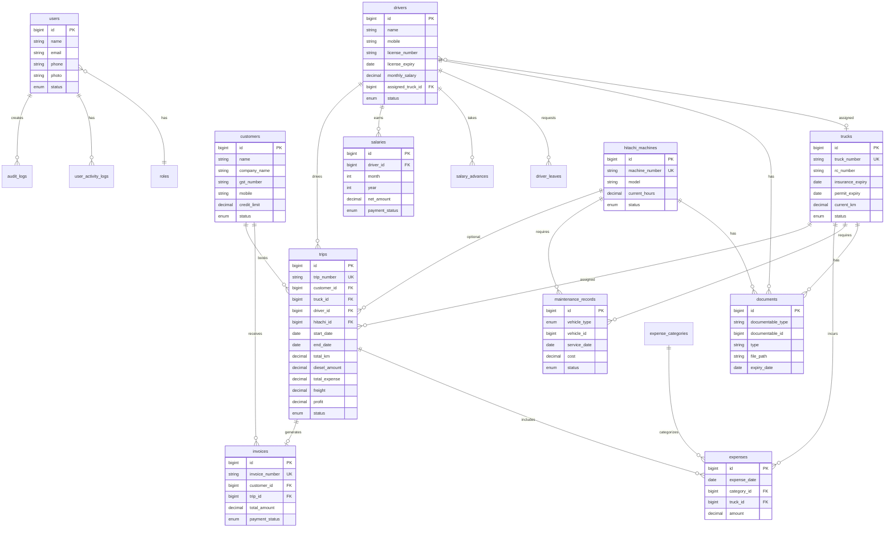

# KK Enterprise ERP - Entity Relationship Diagram

## Key Relationships

- **Trips** are the central business entity linking customers, trucks, drivers, and optionally Hitachi machines
- **Documents** use polymorphic relations for trucks, drivers, Hitachi, and customers
- **Maintenance** uses polymorphic vehicle_type + vehicle_id for trucks and Hitachi
- All main entities include audit columns: `created_by`, `updated_by`, `deleted_by` with soft deletes
